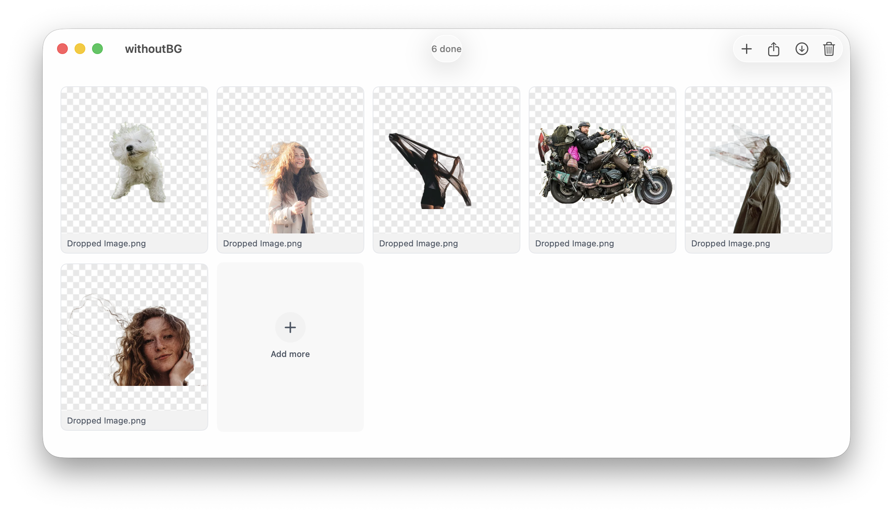

# withoutBG for Mac



**Remove backgrounds on your Mac. Free, private, and local — nothing is uploaded.**

A native macOS app powered by **withoutBG Open Weights**. Drag and drop images for cutouts, or start the optional **Local API** on `http://127.0.0.1:8000` for scripts, the GIMP plugin, and CI.

**[Download →](https://withoutbg.com/mac?utm_source=github&utm_medium=withoutbg-mac-readme&utm_campaign=main-readme)** · **[Local API docs →](https://withoutbg.com/docs/open-model/local-api?utm_source=github&utm_medium=withoutbg-mac-readme&utm_campaign=main-readme)** · **[Headless / CI →](https://withoutbg.com/mac/headless?utm_source=github&utm_medium=withoutbg-mac-readme&utm_campaign=main-readme)**

## See the results


**[Open Weights results →](https://withoutbg.com/open-model/results?utm_source=github&utm_medium=withoutbg-mac-readme&utm_campaign=main-readme)** · **[Cloud API results →](https://withoutbg.com/pro-model/results?utm_source=github&utm_medium=withoutbg-mac-readme&utm_campaign=main-readme)** · **[Compare →](https://withoutbg.com/compare/withoutbg-open-model-vs-pro-model?utm_source=github&utm_medium=withoutbg-mac-readme&utm_campaign=main-readme)**

## Features

### Desktop

- Drop, open (⌘O), or paste (⌘V) up to **20 images**
- Sequential auto-processing with Quick Look preview
- Responsive thumbnail grid with Photos-style selection
- Export transparent PNGs individually or as a zip
- Light / dark / system appearance
- Finder Services: **Remove Background** on selected images

### Local API (optional)

- Start/stop from the menu bar extra or Settings
- `POST /v1/remove-background` — same inference engine as the desktop
- `GET /health`, `GET /openapi.json`
- Request log and operational metrics in the menu bar
- Loopback-only (`127.0.0.1`) — sandboxed, private

## Downloads

| Product | Audience | Scheme |
|---------|----------|--------|
| **withoutBG** (primary) | Creators + developers | `WithoutBG` |
| **WithoutBG Server** (headless) | CI / automation-only | `WithoutBGServer` |

Most users should install **withoutBG**. The headless server build is for environments that only need the HTTP API.

**[Download withoutBG →](https://withoutbg.com/mac?utm_source=github&utm_medium=withoutbg-mac-readme&utm_campaign=main-readme)**

## Requirements

- macOS 14+
- Xcode 16+ (Swift 5.9+) — for building from source
- [XcodeGen](https://github.com/yonaskolb/XcodeGen) (`brew install xcodegen`) — for building from source

## Local API quick start

1. Launch **withoutBG**
2. Click the menu bar icon → **Start Local API**
3. Send a request:

```bash
curl -X POST \
  --data-binary @photo.jpg \
  -H "Content-Type: image/jpeg" \
  http://127.0.0.1:8000/v1/remove-background \
  -o result.png
```

OpenAPI spec: `http://127.0.0.1:8000/openapi.json`

## Build & run

The Xcode project is generated from `project.yml` (gitignored).

```bash
xcodegen generate
open WithoutBG.xcodeproj
```

- **WithoutBG** — windowed desktop app with menu bar Local API controls
- **WithoutBGServer** — menu-bar-only headless distribution (`LSUIElement`)

```bash
# Primary app
xcodebuild -scheme WithoutBG -destination 'platform=macOS' build

# Headless server (advanced)
xcodebuild -scheme WithoutBGServer -destination 'platform=macOS' build
```

Release builds:

```bash
./scripts/release.sh                  # withoutBG DMG (primary)
./scripts/release.sh --server           # WithoutBG Server DMG (headless)
```

Background removal runs on-device via the bundled **withoutBG Open Weights** Core ML model (`wbgnet_oss`, fp32, v10). A `MockProcessor` is available behind the same `BackgroundRemovalProcessor` protocol for UI development without the model.

## Monorepo layout

```
withoutbg-mac/
├── Packages/WithoutBGCore/     Shared inference, model, settings, product links
├── Apps/
│   ├── WithoutBG/              Primary desktop + embedded Local API
│   └── WithoutBGServer/        Headless menu-bar distribution
├── project.yml
└── scripts/release.sh
```

### Inference

Both the desktop queue and Local API serialize through one `SharedInferenceCoordinator` actor backed by a single `CoreMLProcessor` instance — one model load, fair GPU scheduling.

```
Desktop UI ──┐
             ├── SharedInferenceCoordinator ── CoreMLProcessor ── wbgnet_oss
Local API ───┘
```

Shared code lives in `Packages/WithoutBGCore`. To run the UI without the model, inject `MockProcessor()` at app init.

## Migration from WithoutBG Server

The standalone [withoutbg-mac-server](https://github.com/withoutbg/withoutbg-mac-server) repository is consolidated into this monorepo. See [docs/MIGRATION.md](docs/MIGRATION.md).

Existing `com.withoutbg.mac.server` installs continue to work via the **WithoutBGServer** target. New users should install **withoutBG** instead.

## More than Mac

This app is the **native desktop** path: drag-and-drop cutouts plus an optional Local API. Same open-weights technology powers the rest of the ecosystem:

| Surface | Choose when |
|---|---|
| **[GIMP plugin](https://github.com/withoutbg/withoutbg-gimp)** | You edit in GIMP 3 and want a private, mask-first workflow via this Local API or Docker |
| **[Docker / self-host](https://github.com/withoutbg/withoutbg-inference)** | You want an HTTP API or browser UI on your own server (CPU or NVIDIA GPU) |
| **[Python package](https://github.com/withoutbg/withoutbg-python)** | You want to embed withoutBG in scripts, notebooks, or backends |
| **[Hugging Face](https://huggingface.co/withoutbg/withoutbg-openweights-onnx)** · **[Space](https://huggingface.co/spaces/withoutbg/withoutbg)** | You want to try a demo or download the ONNX weights directly |
| **[Cloud API](https://withoutbg.com/pro-model?utm_source=github&utm_medium=withoutbg-mac-readme&utm_campaign=main-readme)** | You need maximum quality without running inference yourself |

## Model

The withoutBG Open Weights Model is a unified Core ML graph hosted with the app. Depth, segmentation, matting, and refinement run in one pass. Built with DINOv3.

Licensed under the [withoutBG Open Model License](https://withoutbg.com/open-model/license?utm_source=github&utm_medium=withoutbg-mac-readme&utm_campaign=main-readme) (Apache 2.0 for withoutBG portions; Meta DINOv3 License for DINOv3 backbone weights). See [THIRD_PARTY_NOTICES](THIRD_PARTY_NOTICES) for model attributions (DINOv3, Depth Anything V2).

## License

withoutBG Open Weights — Apache License 2.0. See [THIRD_PARTY_NOTICES](THIRD_PARTY_NOTICES) for model attributions.

## Support

- **Bugs / questions:** [GitHub Issues](https://github.com/withoutbg/withoutbg-mac/issues)
- **Product page:** [withoutbg.com/mac](https://withoutbg.com/mac?utm_source=github&utm_medium=withoutbg-mac-readme&utm_campaign=main-readme)
- **Commercial:** [contact@withoutbg.com](mailto:contact@withoutbg.com)
